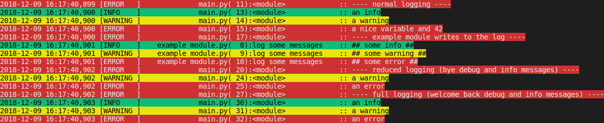

# Simple Logging

[](https://pypi.python.org/pypi/simplelogging)
[](https://github.com/vpoulailleau/simplelogging/blob/master/LICENSE)
[](https://travis-ci.org/vpoulailleau/simplelogging)
[](https://simplelogging.readthedocs.io/en/latest/?badge=latest)
[](https://github.com/ambv/black)
[](https://pepy.tech/project/simplelogging)
[](https://codeclimate.com/github/vpoulailleau/simplelogging/test_coverage)
[](https://codeclimate.com/github/vpoulailleau/simplelogging/maintainability)

Logging made simple, no excuse for any debug print call.

* Free software: BSD 3-Clause license
* Documentation: https://simplelogging.readthedocs.io.


## Features

* Logging management (debug, information or error messages)
* Simple logging setup
* Based on Python `logging` module of the standard library
* Based on [colorlog](https://github.com/borntyping/python-colorlog) for colored log on console

For advanced users:

* The provided logger is one of those from `logging`, this means it can be configured so that log messages are sent by email, HTTP, or any of the options available in https://docs.python.org/3/library/logging.handlers.html.
* The StreamHandler and the associated Formatter are those provided by `colorlog`.

## Example

### Basic usage

```python
import simplelogging

# log = simplelogging.get_logger(console_level=simplelogging.DEBUG)
# log = simplelogging.get_logger(file_name="log.txt")
log = simplelogging.get_logger()

a_string_variable = "hello"
an_integer_variable = 42
a_floating_point_variable = 3.14

log.debug("some debug")
log.info("some info")
log.info(
    "some variables: %s, %d, %f",
    a_string_variable,
    an_integer_variable,
    a_floating_point_variable,
)
log.warning("some warning")
log.error("some error")
log.critical("some critical error")

try:
    x = 1 / 0
except ZeroDivisionError as error:
    log.exception(error)
```


Keep in mind that you shouldn't do string formatting yourself. Delegate formatting to `simplelogging` (i.e. `logging` in this case), the formatting will be done only if necessary, that is if the message is going to be displayed. See above examples of how to display variables.

### Usage with modules

#### example_module.py

```python
import simplelogging

log = simplelogging.get_logger()


def log_some_messages():
    log.debug("## some debug ##")
    log.info("## some info ##")
    log.warning("## some warning ##")
    log.error("## some error ##")
```

#### main.py

```python
import example_module
import simplelogging

# log = simplelogging.get_logger(console_level=simplelogging.DEBUG)
# log = simplelogging.get_logger(file_name="log.txt")
log = simplelogging.get_logger()

a_variable = "a nice variable"
another_variable = 42

log.error("---- normal logging ----")
log.debug("a debug message")
log.info("an info")
log.warning("a warning")
log.error("%s and %d", a_variable, another_variable)

log.error("---- example_module writes to the log ----")
example_module.log_some_messages()

log.error("---- reduced logging (bye debug and info messages) ----")
log.reduced_logging()
log.debug("a debug message")
log.info("an info")
log.warning("a warning")
log.error("an error")

log.error("---- full logging (welcome back debug and info messages) ----")
log.full_logging()
log.debug("a debug message")
log.info("an info")
log.warning("a warning")
log.error("an error")
```

#### Result in the console




More examples are provided in the documentation: https://simplelogging.readthedocs.io.

## TODO

* add tests
* add type annotations
* add docstring
* commit hooks
* describe pros/cons and alternatives
* release 1.0!

## Credits

This package is an extension of the [logging](https://docs.python.org/3/howto/logging-cookbook.html) package in the Python standard library. Coloring of the console relies on [colorlog](https://github.com/borntyping/python-colorlog).

## Changelog

### 0.12.0 (Not released yet)

* Drop Python 2.5 support

### 0.11.0 (2020-08-31)

* Use poetry

### 0.10.0 (2019-09-16)

* setup.py: require pytest-runner only when necessary
* Remove Python 3.4 support

### 0.9.0 (2018-12-14)

* Improve documentation
* Add tests
* Change API for easy logging level change

### 0.8.0 (2018-12-09)

* Improve documentation
* Change default format: enlarge level size for critical errors

### 0.7.0 (2018-12-08)

* Fix logging to file

### 0.6.0 (2018-12-07)

* Colored output on console
* Improved documentation

### 0.5.0 (2018-12-02)

* Fix README rendering in PyPI

### 0.4.0 (2018-12-02)

* Fix bump config

### 0.3.0 (2018-12-02)

* First release on PyPI.
